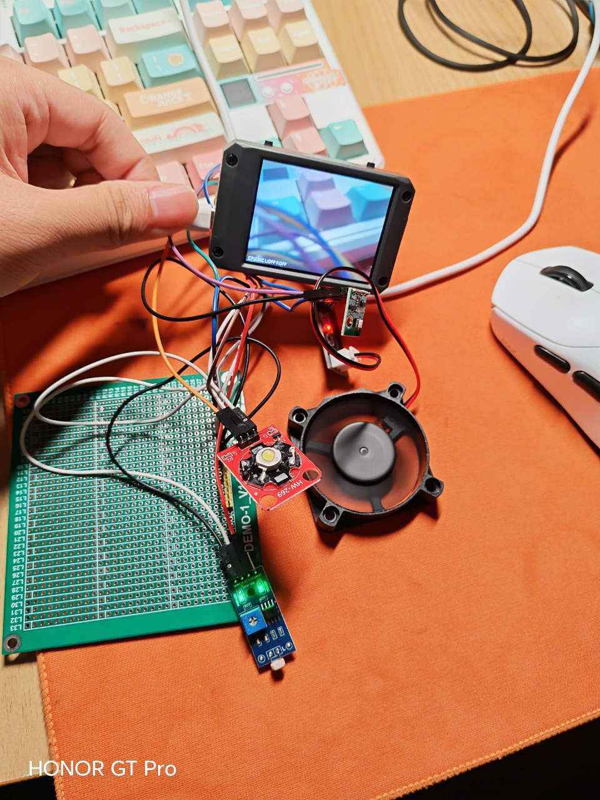
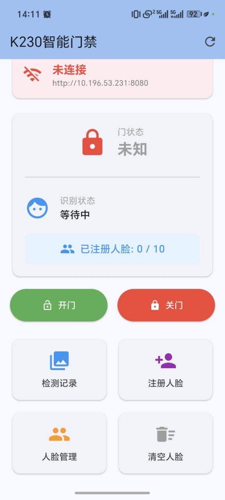

# K230 智能门禁系统 Smart Door Lock

> 基于嘉楠 K230 的边缘端人脸识别智能门禁：K230 端完成人脸检测与识别并控制门锁，通过 WiFi + HTTP 与 Flutter 手机 App 联动，集成自动补光与温控散热。软硬件 + 移动端全栈打通。

## 📷 演示

| 硬件实物 | 手机 App |
|---|---|
|  |  |

> 左：K230 + LCD 显示实时画面、补光 LED、散热风扇；右：Flutter App 主页（门状态 / 识别状态 / 远程开关 / 人脸管理）。

## 项目简介

本项目实现了一套低成本的边缘端智能门禁系统。**人脸检测与识别全部在 K230 芯片本地完成**，无需上云，隐私性高、响应快；识别到已注册人脸即自动开门，并通过 WiFi 把识别结果、抓拍图片实时推送到自研 Flutter App。系统还集成了环境控制：根据画面亮度自动补光、根据芯片温度自动调节散热风扇转速。整机成本约为市面主流产品的 43%。

- **身份**：个人毕业设计，独立完成（K230 固件 + Flutter App + 硬件搭建）
- **时间**：【2025.xx – 2025.xx，按实际填写】

## 系统架构

```
            ┌──────────────────────────── K230 (MicroPython) ───────────────────────────┐
   摄像头 ──▶ 人脸检测 (kmodel) ─▶ 人脸识别 (kmodel) ─▶ 余弦相似度匹配 ─▶ 人脸库 (最多10人)
            │           │                                    │                          │
   LCD 显示 ◀───────────┘                          识别成功 ─▶ 自动开门 (5s 后自动关门)     │
            │                                                                            │
   补光 LED ◀─ 按画面亮度自动调节 (PWM)        HTTP 服务器 (端口 8080, REST API)            │
   散热风扇 ◀─ 按芯片温度自动调速 (PWM)                 ▲                                   │
            └─────────────────────────────────────────┼───────────────────────────────┘
                                                       │  WiFi / HTTP
                                                       ▼
                                          ┌──────── Flutter App (Android) ────────┐
                                          │ 门状态轮询 · 远程开/关门 · 人脸注册       │
                                          │ 检测记录(本地 Hive 存储) · 环境监控       │
                                          └────────────────────────────────────────┘
```

## 技术栈

- **边缘端 / 固件**：嘉楠 K230、MicroPython、nncase 运行时（KPU 加速）、人脸检测 + 人脸识别 kmodel、AI2D 预处理、5 点关键点 umeyama 仿射对齐
- **移动端**：Flutter / Dart、Material 3、Hive（本地数据库，存检测记录）、http
- **通信**：WiFi（STA 模式，带断线自动重连）、HTTP / REST、多线程（视觉主循环 + HTTP 服务线程）
- **显示 / 外设**：ST7701 LCD、PWM 驱动补光 LED 与散热风扇

## 主要功能

- **人脸识别自动开门**：本地余弦相似度匹配（阈值 0.55），识别成功自动开门，5 秒后自动关门
- **远程控制**：手机 App 远程开 / 关门，2 秒轮询门状态与识别状态
- **人脸注册与管理**：通过 K230 摄像头注册人脸，最多 10 人，支持单人多张特征取平均、删除、清空
- **检测记录**：识别 / 陌生人事件抓拍并推送到 App，按手机本地时间存入 Hive，带去重
- **环境自适应**：画面偏暗自动开补光 LED；芯片温度升高自动调高风扇转速（50–80°C 区间，带回差），均支持手动 / 自动切换
- **双端控制**：除手机 App 外，K230 自带网页控制面板（浏览器访问其 IP 即可）

## 关键指标

| 指标 | 结果 |
|------|------|
| 人脸识别准确率 | 86% |
| 误检率 | < 5% |
| 整机成本 | 约为市面主流产品的 43% |
| 人脸库容量 | 最多 10 人（单人可多张特征） |
| 识别阈值 | 余弦相似度 0.55 |

## 主要接口（K230 HTTP API）

| 路径 | 说明 |
|------|------|
| `GET /status` | 查询门状态 |
| `GET /open` `/close` | 远程开 / 关门 |
| `GET /register` | 从摄像头注册当前人脸 |
| `GET /face_recog` | 查询当前识别结果 |
| `GET /face_image` | 获取最近一次抓拍图片 |
| `GET /face_list` `/delete_face/<name>` `/clear_faces` | 人脸库管理 |
| `GET /env_status` `/led/*` `/fan/*` | 环境状态与补光、风扇控制 |

## 目录结构

```
smart-door-lock/
├── README.md
├── hardware.jpg / app_home.jpg     演示图
├── k230_smart_door_with_env.py     K230 主程序（固件）
├── main.dart                       App 主页 / 状态轮询
├── monitor_page.dart               检测记录页
├── upload_face_page.dart           人脸注册页
├── image_item_model.dart           检测记录数据模型
└── image_item_model.g.dart         Hive 自动生成代码
```

## 如何运行

**K230 固件**
1. 将人脸检测 / 识别 kmodel 与 anchors 文件放到 K230 对应路径（见代码顶部 `FACE_DET_KMODEL` 等配置）。
2. 修改代码顶部的 WiFi 配置 `WIFI_SSID` / `WIFI_PASSWORD` 为你的网络。
3. 用 CanMV IDE 运行 `k230_smart_door_with_env.py`，串口会打印设备 IP。

**Flutter App**
1. 用 Android Studio / VS Code 打开工程，`flutter pub get` 安装依赖。
2. 把 `main.dart` 里的 `baseUrl` 改成 K230 实际 IP（形如 `http://192.168.x.x:8080`）。
3. `flutter run` 安装到手机，确保手机与 K230 在同一 WiFi。

> ⚠️ 上传到公开仓库前，请把 `WIFI_SSID` / `WIFI_PASSWORD` 改成占位符（如 `your_wifi` / `your_password`），不要提交真实密码。

## 后续计划

- 【可选：加活体检测防照片攻击 / 提升弱光识别率 / 增加门锁开关的物理执行机构等】

---
作者：林凯轩 ｜ 电子信息工程 ｜ github.com/LKX20050501
